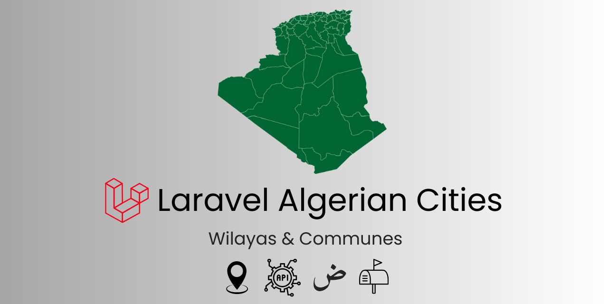

<div align="center">
    
    <div align="center">
        <a href="https://github.com/kossa/algerian-cities/actions"></a>
        <a href="https://packagist.org/packages/kossa/algerian-cities"></a>
        <a href="https://packagist.org/packages/kossa/algerian-cities"></a>
        <a href="https://github.com/kossa/algerian-cities/actions"></a>
        <a href="https://packagist.org/packages/kossa/algerian-cities"></a>
    </div>
</div>

------

**Laravel Algerian Cities** : A comprehensive Laravel package to easily manage and interact with Algerian administrative divisions. 

It provides functionality to load Wilayas (provinces) and Communes (municipalities) in both Arabic and French, complete with postal codes and precise latitude/longitude coordinates for each commune.

## Features
- Includes all 58 Algerian Wilayas and 1541 Communes.
- Wilaya and Commune Eloquent models with relationships.
- Supports Arabic and French languages.
- Includes postal codes and latitude/longitude for each commune.
- Available as API endpoints.
- Helper functions for easy integration in Blade views.

## Requirements

- **PHP** : 8.1 or higher
- **Laravel** : 10 and 11

## Installation

You can install the package via composer:

```bash
composer require kossa/algerian-cities
```

Next, publish the migrations and seeders by running the installation command:


```bash
php artisan algerian-cities:install
```

## Usage
### Basic usage

The package provides two models: `Wilaya` and `Commune`. 

A `Wilaya` has many `Commune`, and you can interact with them just like any other Eloquent models.

```php
namespace App;

use Illuminate\Database\Eloquent\Model;
use Kossa\AlgerianCities\Commune;
use Kossa\AlgerianCities\Wilaya;

class AnyClass extends Model
{
    // Retrieve all Wilayas
    $wilayas = Wilaya::all();

    // Retrieve all Communes
    $communes = Commune::all();

    // Get all Communes belonging to Algiers (Wilaya ID: 16)
    $algiers_communes = Commune::where('wilaya_id', 16)->get();
}
```

### Using Helper Functions

The package provides several helper functions for convenient data retrieval:

```php
$wilayas = wilayas();                                                // Get all Wilayas as $id => $name
$wilayas = wilayas('arabic_name');                                   // Get all Wilayas with names in Arabic
$communes = communes();                                              // Get all Communes as $id => $name
$communes = communes(16);                                            // Get all Communes of Algiers (Wilaya ID: 16) as $id => $name
$communes = communes(16, $withWilaya = true);                        // Get all Communes of Algiers (16) including Wilayas: "Alger Centre, Alger"
$communes = communes(16, $withWilaya = true, $name = 'arabic_name'); // Get all Communes of Algiers (16) with Wilayas in Arabic: "الجزائر الوسطى, الجزائر"

$single_commune = commune(1);                      // Retrieve a single Commune model
$single_commune = commune(1, $withWilaya = true);  // Retrieve a single Commune model, including its Wilaya
$single_wilaya = wilaya(1);                        // Retrieve a single Wilaya model
```
 

### Blade Templates / Views

You can leverage the provided helpers or models to populate `<select>` elements:

```html
<!-- Select for Wilayas -->
<select>
    @foreach (wilayas() as $id => $wilaya)
        <option value="{{ $id }}">{{ $wilaya }}</option>
    @endforeach
</select>

<!-- Select for Communes -->
<select>
    @foreach (communes() as $id => $commune)
        <option value="{{ $id }}">{{ $commune }}</option>
    @endforeach
</select>

<!-- Select for Communes of Algiers (Wilaya ID: 16) -->
<select>
    @foreach (communes(16) as $id => $commune)
        <option value="{{ $id }}">{{ $commune }}</option>
    @endforeach
</select>

<!-- Select for Communes with Wilaya Name (e.g., "Adrar, Adrar") -->
<select>
    @foreach (communes(null, true) as $id => $commune)
        <option value="{{ $id }}">{{ $commune }}</option>
    @endforeach
</select>

<!-- Select for Communes with Wilaya Name in Arabic (e.g., "أدرار, أدرار") -->
<select>
    @foreach (communes(null, true, 'arabic_name') as $id => $commune)
        <option value="{{ $id }}">{{ $commune }}</option>
    @endforeach
</select>
```

## Using the Package as an API

This package includes `api.php` routes, allowing you to interact with the data through a RESTful API. Here are the available endpoints:

| Verb | URI                          | Description                                        |
|------|------------------------------|----------------------------------------------------|
| GET  | `/api/wilayas`               | Retrieve all Wilayas                               |
| GET  | `/api/wilayas/{id}`          | Retrieve a specific Wilaya by ID                   |
| GET  | `/api/wilayas/{id}/communes` | Retrieve all Communes from a specific Wilaya by ID |
| GET  | `/api/communes`              | Retrieve all Communes                              |
| GET  | `/api/communes/{id}`         | Retrieve a specific Commune by ID                  |
| GET  | `/api/search/wilaya/{q}`     | Search Wilayas by name or Arabic name              |
| GET  | `/api/search/commune/{q}`    | Search Communes by name or Arabic name             |

## Future Planned Features

- [ ] Add support for Dairas (districts), including relationships with Wilayas and Communes
- [ ] Add support for additional languages
- [ ] Add a configuration file to allow customizing package behaviors
- [ ] Add support for caching to optimize API responses

## Contribution

We welcome all contributions! Please follow these guidelines:

1. Adhere to the [PSR-12](https://www.php-fig.org/psr/psr-12/) coding standard.
2. Document any changes in behavior — ensure `README.md` and other relevant documentation are updated accordingly.
3. Submit one pull request per feature — for multiple changes, create separate pull requests.

## Reporting Issues & Suggesting Features

If you encounter any issues or have ideas for new features, please [open an issue](https://github.com/kossa/algerian-cities/issues/new). 

We appreciate your feedback and contributions to help improve this package.

## Credits

- [Kouceyla](https://github.com/kossa) , and all [contributors](https://github.com/kossa/algerian-cities/graphs/contributors) who have helped improve and enhance the project.
- The list of Wilayas and Communes is sourced from [Wilaya-Of-Algeria](https://github.com/bahinapster/Wilaya-Of-Algeria/).

## Security Reports

If you discover any security vulnerabilities, please report them by emailing the package maintainer at `hadjikouceyla at gmail`. 

## ⭐ Support Us

If you find this package helpful, please consider giving it a ⭐ on [GitHub](https://github.com/kossa/algerian-cities) !
Your support encourages us to keep improving the project.
Thank you!

## License

This package is open-sourced software licensed under the [MIT License](https://opensource.org/licenses/MIT).